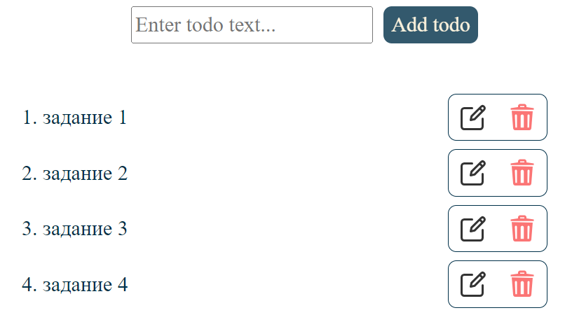
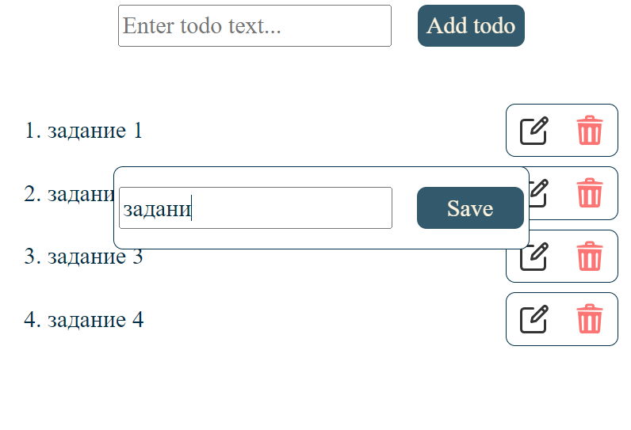

# Todo list

В приложении реализован todo list. Заметки можно отредактировать и удалить по завершении.

## Содержание

* [Технологии](#технологии)
* [Начало работы](#начало_работы)
* [Скриншоты](#скриншоты)

<a name="#технологии">Технологии</a>
-----------------------------------

Клиентская часть написана на React JS. Для управления состоянием полей ввода использовалась библиотека React Hook Form. В качестве менеджера состояния использовался Redux.

Серверная часть написана на Express JS.

Взаимодействие клиентской и серверной частей реализовано с помощью библиотеки axios.

<a name="#начало_работы">Начало работы</a>
-----------------------------------

Порт сервера: http://localhost:8000

Порт клиента: http://localhost:3000

cd src\server --> node server

npm start

<a name="#скриншоты">Скриншоты</a>
-----------------------------------

